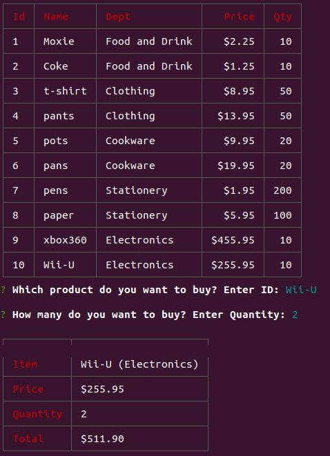

# bamazon

## Setup

1. install node modules

```
$ npm install
```

2. Create an enviroment file in the root of the project named `.env`

```
host = localhost
port = 3306
user = <user>
password = <password>
```

## Run

```
$ npm run customer
```


